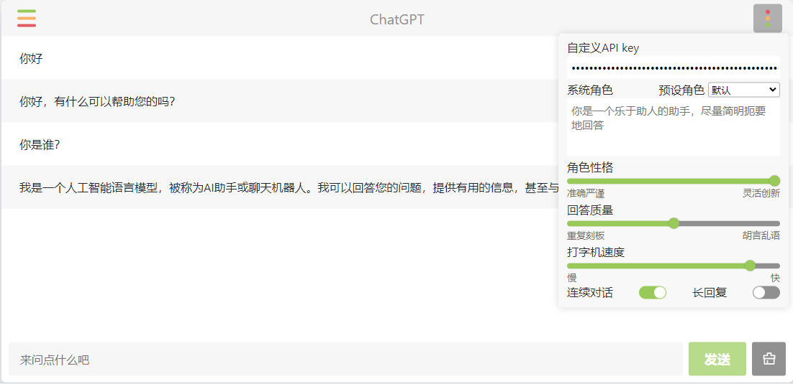

只需要一个HTML文件，就可以快速开启ChatGPT聊天



他能做什么用？

平常我们使用chatgpt需要配魔法上网才能登上官方网站，对于很多人来说这是个很棘手的问题，如果你有个海外云服务器，就可以通过这种方式部署一个自己专有的chatgpt，只要指定key，就可以愉快的用上chatgpt了。


你需要准备啥？

* 一个能正常访问 api.openai.com 的海外服务器
* 一个chatgpt key
* 没有了


只要在界面右侧配置好你的chatgpt key 就可以连上chatgpt与机器人聊天，这个key 是怎么来的呢？

在openai官方登录后访问 https://platform.openai.com/account/api-keys ，可以申请key，以sk开头。如果你的账号是从别的渠道购买的，通常也会带一个key

申请完key之后，我们唯一要做的一件事就是配置Nginx，不知道Nginx是什么的同学可自行搜下，简单来讲就是一个提供Web服务的服务器以及反向代理工具，我们只需要把那个html文件配置在nginx，程序就能跑起来了。


nginx配置

```nginx
# 把这段代码配置到server 模块中
gzip  on;
gzip_min_length 1k;
gzip_types text/event-stream;

location ^~ /chatgpt/v1 {

    proxy_pass https://api.openai.com/v1;
    proxy_set_header Host api.openai.com;
	proxy_pass_header Authorization;
	proxy_buffering off;

}
location /chatgpt {
	alias /usr/share/nginx/html/;  # 实际地址看你具体把html文件放在哪里
 	index youchat.html;
}
```


最后重启 nginx

```
nginx -s reload
```


大功告成！

最后访问：

> http://127.0.0.1/chatgpt


1、对外暴露自己的key存在不安全因素，如果不是你自己的搭建的服务请谨慎使用

2、无节制频繁调用API也会导致封号

3、多人共用一个key也会有封号风险

forkhttps://github.com/xqdoo00o/chatgpt-web

微信体验交流群
加入 ChatGPT 体验交流群，与 AI 技术领域的专家和爱好者一起探讨最前沿的信
息！在这里，你可以体验到最先进的人工智能技术，与志同道合的人交流，共同
提升你的知识水平。不管你是专业人士还是爱好者，都欢迎加入我们的群体！


